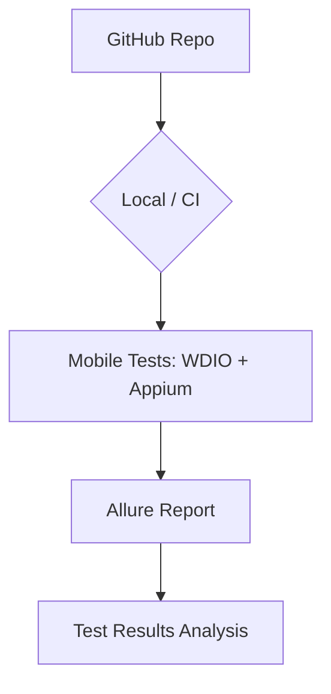

# 📱 Desafio de Automação de Testes Mobile — Carrefour Banco


Projeto de automação de testes mobile utilizando **WebDriverIO** e **Appium**, desenvolvido para o desafio técnico do **Carrefour Banco**. O projeto cobre 10 cenários essenciais no aplicativo Native Demo App, utilizando o padrão Page Object Model.

---

## 🏗️ Arquitetura do Projeto



---

## 📋 Índice

- [Tecnologias Utilizadas](#-tecnologias-utilizadas)
- [Pré-requisitos](#-pré-requisitos)
- [Instalação e Configuração](#-instalação e-configuração)
- [Executando os Testes](#-executando-os-testes)
- [Estrutura do Projeto](#-estrutura-do-projeto)
- [Casos de Teste Cobertos](#-casos-de-teste-cobertos)
- [Relatórios de Teste](#-relatórios-de-teste)

---

## 🛠 Tecnologias Utilizadas

| Tecnologia | Versão | Descrição |
|---|---|---|
| **Node.js** | >= 18 | Runtime JavaScript |
| **WebDriverIO** | 8.x | Framework de testes Mobile |
| **Appium** | 2.x | Driver de automação Mobile |
| **Allure Report** | 2.x | Relatórios de testes detalhados |
| **Chai** | 4.x | Biblioteca de asserções |

---

## ✅ Pré-requisitos

- [Node.js](https://nodejs.org/) versão 18 ou superior
- [Appium Server](https://appium.io/) v2.0+ rodando
- **Android SDK** e um emulador ativo (Android v11+)
- **Java JDK** v11+
- **APK do App**: [WebdriverIO Native Demo App](https://github.com/webdriverio/native-demo-app/releases) (colocar em `app/wdio-demo.apk`)

---

## 🚀 Instalação e Configuração

1. **Clone o repositório:**
```bash
git clone https://github.com/Rafael-M-Sales/desafio-mobile-carrefour.git
cd desafio-mobile-carrefour
```

2. **Instale as dependências:**
```bash
npm install
```

---

## ▶️ Executando os Testes

### Executar todos os cenários
```bash
npm test
```

### Gerar e abrir relatório Allure
```bash
npm run report:generate
npm run report:open
```

---

## 📁 Estrutura do Projeto

```
desafio-mobile-carrefour/
├── app/                  # Binários do aplicativo (.apk)
├── test/
│   ├── pageobjects/      # Page Object Model (Screens)
│   │   ├── page.js       # Classe base
│   │   ├── login.page.js # Login Screen
│   │   ├── home.page.js  # Home Screen
│   │   └── forms.page.js # Forms Screen
│   └── specs/
│       └── desafio.spec.js # 10 Cenários de Teste
├── wdio.conf.js          # Configurações do WebdriverIO
├── package.json          # Dependências e scripts
└── README.md
```

---

## 👨‍🏫 Foco Educativo e Didático

Este projeto segue as melhores práticas de engenharia de QA:
- **Page Object Model (POM)**: Separação clara entre a lógica de interação e os cenários de teste.
- **Hooks de Teste**: Configuração e limpeza automática do estado do app.
- **Comentários Explicativos**: Código documentado para facilitar o entendimento do fluxo de automação.

---

## 🧾 Casos de Teste Cobertos

### 📱 Automação Mobile (`Native Demo App`)

| # | Cenário | Funcionalidade | Descrição | Status Esperado |
|---|---|---|---|---|
| 1 | Login com Sucesso | Autenticação | Login válido com dados de QA | Sucesso |
| 2 | Login com Erro (Email) | Autenticação | Validação de formato de email inválido | Erro |
| 3 | Login com Erro (Senha) | Autenticação | Tentativa de login com senha vazia | Erro |
| 4 | Navegação WebView | Navegação | Acesso à tela de conteúdo web | Sucesso |
| 5 | Navegação Swipe | Navegação | Acesso e interação com a tela de swipe | Sucesso |
| 6 | Navegação Drag | Navegação | Acesso à tela de Drag and Drop | Sucesso |
| 7 | Form: Switch | Formulários | Interação com componente Switch | Sucesso |
| 8 | Form: Dropdown | Formulários | Seleção de itens no picker | Sucesso |
| 9 | Form: Status | Formulários | Validação de botões ativos/inativos | Sucesso |
| 10 | Fluxo E2E Completo | E2E | Login -> Menu -> App -> Home | Sucesso |

---

## 👤 Autor

**Rafael M. Sales**

---

## 📄 Licença
Este projeto está sob a licença MIT.
